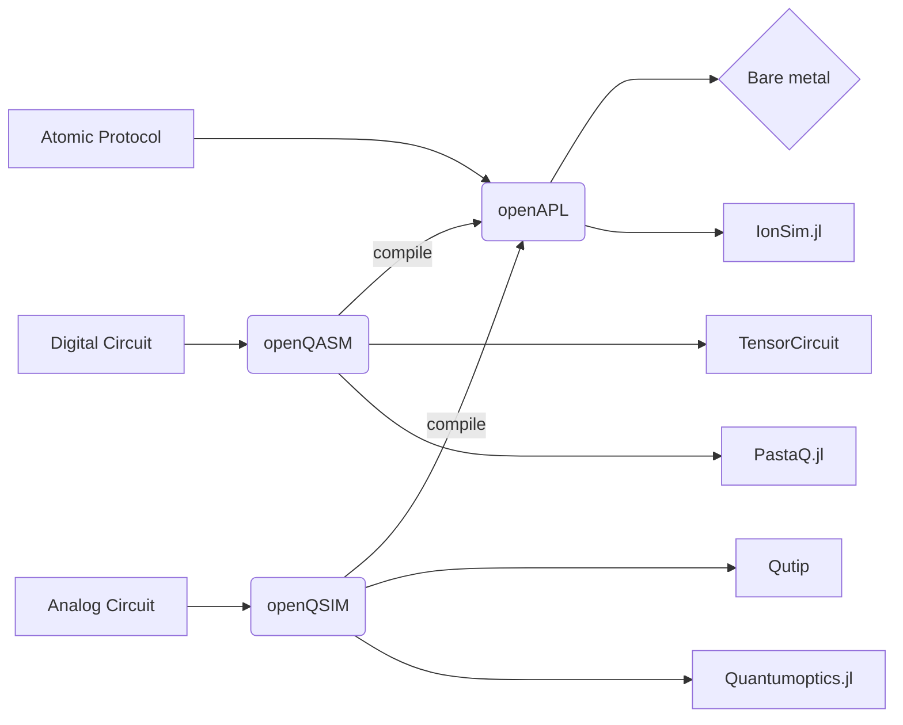

# 

<h2 align="center">
    Program the world's first open-source, full-stack quantum computer.
</h2>

[](https://github.com/ambv/black)

[](https://github.com/OpenQuantumDesign/quarry/actions/workflows/CI.yml)


## Installation <a name="installation"></a>
To install, 
```bash
pip install git+https://github.com/OpenQuantumDesign/quarry.git
```

Or clone the repository locally and install with:

```bash
git clone https://github.com/OpenQuantumDesign/quarry
pip install .
```

## Getting Started <a name="Getting Started"></a>

As an example of a simple single-qubit Rabi-flopping experiment, 
using the `Analog` layer interface and a classical emulation backend.
```python
import matplotlib.pyplot as plt

from oqd_core.interface.analog.operator import *
from oqd_core.interface.analog.operation import *
from oqd_core.backend.metric import *
from oqd_core.backend.task import Task, TaskArgsAnalog
from oqd_analog_emulator.qutip_backend import QutipBackend

X = PauliX()
Z = PauliZ()

Hx = AnalogGate(hamiltonian=X)

circuit = AnalogCircuit()
circuit.evolve(duration=10, gate=Hx)
circuit.measure()

args = TaskArgsAnalog(
  n_shots=100,
  fock_cutoff=4,
  metrics={"Z": Expectation(operator=Z)},
  dt=1e-3,
)

task = Task(program=circuit, args=args)

backend = QutipBackend()
results = backend.run(task=task)

plt.plot(results.times, results.metrics["Z"], label=f"$\\langle Z \\rangle$")
```

## The stack <a name="stack"></a>




## Documentation <a name="documentation"></a>

Documentation is implemented with [MkDocs](https://www.mkdocs.org/) and can be read from the [docs](https://github.com/OpenQuantumDesign/midstack/tree/main/docs) folder.

To install the dependencies for documentation, run:

```
pip install -e ".[docs]"
```

To deploy the documentation server locally:

```
cp -r examples/ docs/examples/
mkdocs serve
```

After deployment, the documentation can be accessed from http://127.0.0.1:8000
