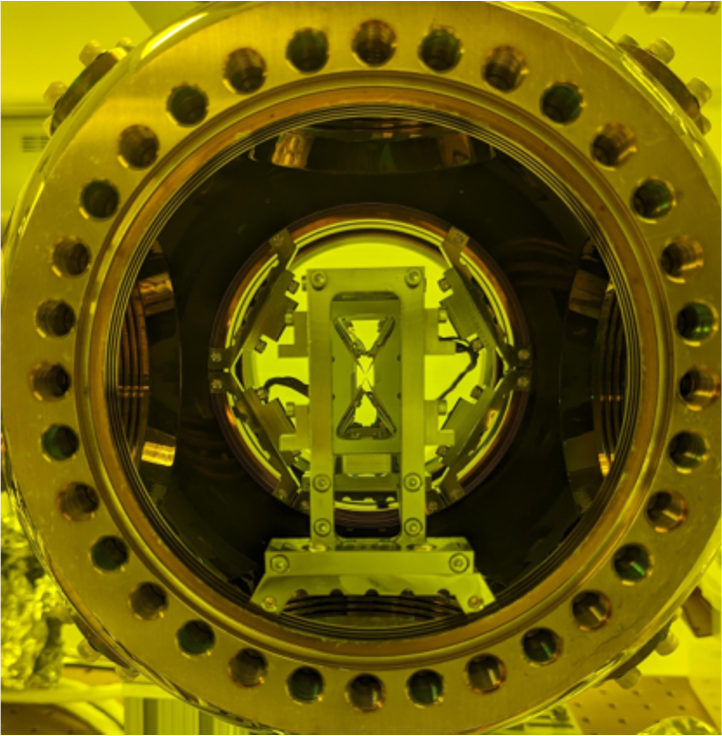

## Open Quantum Design: Hardware 

### Bloodstone
* Ion species: 171Yb+
* Target number of qubits: 30 – 50
* Trap architecture: Segmented Blade Trap
* SPAM individual addressing: DMD
* Coherent individual addressing with: Double-pass AOM + AOD

### Beryl
* Ion species: 171Ba+
* Target number of qubits: 16
* Trap architecture: Sandia HOA Trap 2.0
* SPAM individual addressing: AOMs
* Coherent individual addressing: Laser written waveguide + AOMs

## Real-time Control System
The OQD stack builds on the [Sinara](https://sinara-hw.github.io/) and [ARTIQ](https://m-labs.hk/artiq/) 
ecosystems for real-time control.

### Sinara
Sinara is an open-source hardware ecosystem originally designed for use in quantum physics experiments running the 
ARTIQ control software. The hardware is also suitable for a broad range of laboratory and test & measurement 
applications. It is licensed under CERN OHL v1.2.

### ARTIQ (Advanced Real-Time Infrastructure for Quantum)
The Advanced Real-Time Infrastructure for Quantum physics framework is a software framework developed by M-Labs that 
provides Python bindings to the Sinara real-time signal generation and detection apparatus at the core of the 
electrical apparatus. ARTIQ functions by exposing control of the individual channels of custom-specified Sinara 
hardware in the Python programming language. The system maintains an internal clock and timeline. Events specified 
programmatically by the user are applied to the timeline and sent to the Sinara hardware with a series of queues. 
The Sinara hardware then executes the instructions with nanosecond precision on a series of FPGAs. 

### DAX (Duke ARTIQ Extensions)
The Duke ARTIQ Extensions (DAX) are additional tools and capabilities drawn from traditional software design principles
for the ARTIQ framework. ARTIQ allows low-level access to individual channels on the Sinara hardware. 
DAX provides a framework for grouping channels into logical modules representing appropriate experimental apparatus 
abstractions and services that use those modules to perform regular, repeatable tasks. 